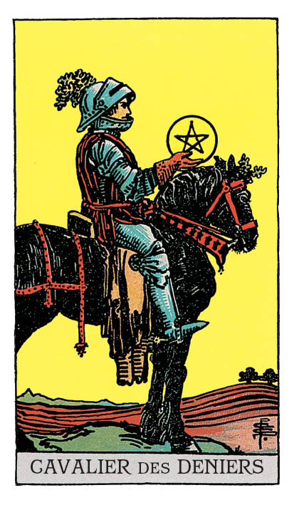

# Cavalier de Denier

## Signification

**Type de Carte :** Arcane Mineur de la Suite des Deniers, associée au monde matériel, à l'argent et aux possessions
**Élément :** Terre
**Numérologie / Rang :** Cavalier — l'adolescent excessif, le "tout ou rien", le changement et l'action

## Description

Un cavalier et son cheval sont au milieu d'un champ labouré, prêt à recevoir les graines qui deviendront, avec le temps et des efforts, le fruit de la récolte. La couleur noire du cheval, l'ocre du vêtement, le vert des feuilles de chêne du heaume évoquent l'Elément du Cavalier, la Terre. La posture calme du Cavalier et du cheval évoquent l'Ancrage. Le Cavalier de Denier est dans cette Energie posée, "terrienne". Après avoir découvert le plan matériel et ses possibilités en tant que Valet de Denier, il est maintenant déterminé à faire fructifier ses ressources. Il a compris qu'il doit poser les bases de l'Abondance à venir même si cela engage un labeur lent, difficile ou répétitif.

## Mots-clés

### À l'endroit
- Esprit pratique et méthodique
- Patience
- Travail acharné, régularité, routine
- Efficacité

### À l'envers
- Se montrer paresseux, procrastiner
- S'entêter
- S'ennuyer

## Interprétation

Le Cavalier de Denier est solidement ancré dans le plan matériel de l'existence. De fait, il n'est ni romantique ni innovant… mais sa détermination à réussir est sans faille. Elle se manifeste par une Energie et un travail rigoureux et méthodique ainsi qu'une régularité sans faille.

Le Cavalier de Denier, malgré son caractère "adolescent", fait preuve d'une grande maturité. Il a le sens des responsabilités et s'investit pleinement dans ses tâches.

Quand il apparaît dans un Tirage, il vous invite à déployer le même type d'Energie en étant vous-même la personne sérieuse et robuste sur qui votre entourage peut s'appuyer.

Pour atteindre vos objectifs, creusez votre sillon à votre rythme mais de façon régulière, sans compliquer inutilement les choses. Il est possible d'ailleurs que vous n'ayez rien à changer du tout à vos habitudes ni à ce que vous faites. Soyez prêt(e) à aller au bout de vos projets. Le Cavalier de Denier ne s'arrête pas en cours de route… et vous ne devez pas le faire non plus.

Le Cavalier de Denier vous invite également à faire preuve d'esprit pratique, de réalisme et d'agilité. Il conseille d'investir vos ressources – argent, temps, Energies, compétences… – dans le domaine le plus porteur ; celui qui vous permettra d'obtenir un solide retour sur investissement.

Perfectionniste, le Cavalier de Denier vous invite à planifier, ordonner et à penser au moindre détail pour ne pas faire les choses à moitié et assurer votre succès.

Enfin, comme toutes les Cartes de Cour, le Cavalier de Denier peut représenter une personne "de la vraie vie" dans votre entourage ou une personne que vous allez bientôt rencontrer. Le Cavalier de Denier représente alors une personne qui se focalise sur le "comment faire ?" plutôt que sur le "pourquoi ?" des choses. Modérée dans ses opinions et dans ses propos, cette personne peut vous aider à mettre en place une "routine positive" dans votre vie et vous encourager à maintenir vos efforts… surtout si vous êtes actuellement tenté(e) de baisser les bras.

## Cavalier de Denier et l'Amour

Contrairement au Cavalier de Bâton, le Cavalier de Denier ne transmet pas une Energie torride. Mais… il est là pour vous. Présence sécurisante et stable, vous pouvez compter sur lui pour vous épauler.

Si vous recherchez une relation stable, repérez les personnes dans votre vie qui sont patientes, travailleuses et dignes de confiance. Le Cavalier de Denier est peut-être un peu "gauche" en Amour ; il manque peut-être d'aisance relationnelle et de romantisme mais il n'hésitera pas à s'investir dans une relation sur le long terme.

Dans cette recherche de partenaire, le Cavalier de Denier vous invite également à utiliser les "bonnes vieilles recettes" qui ont fait leurs preuves et de les utiliser avec régularité. Faire des rencontres est un objectif comme un autre alors mettez votre esprit "pratico-pratique" à l'œuvre pour rencontrer des personnes qui vous correspondent.

Si vous êtes en couple, inspirez-vous du Cavalier de Denier, soyez la personne sur qui votre partenaire peut compter. Soyez prêt(e) à travailler sur votre relation comme vous le feriez sur un projet. Prévoyez du temps l'un pour l'autre, surtout si vous avez le sentiment que votre couple est entré dans une routine qui vous satisfait de moins en moins.

## Cavalier de Denier et le Travail

S'il y a bien un domaine dans lequel le Cavalier de Denier brille, c'est le travail ! Il s'agit d'une Carte de très bon augure dans ce domaine.

Comme le Cavalier de Denier, investissez-vous dans ce domaine de votre vie. Comme lui, plantez aujourd'hui les graines qui demain vous assureront Abondance et sécurité. Il peut s'agir pour vous d'acquérir de nouvelles compétences, de sortir de votre zone de confort pour vous développer professionnellement… L'Energie que vous mettez aujourd'hui dans ce projet est un investissement pour votre avenir professionnel.

L'Energie du Cavalier de Denier symbolise un marathon plutôt qu'un sprint. Planifiez votre course. Faites les choses dans l'ordre, avec méthode. Soyez prêt(e) à travailler et à être efficace sur la durée. Cela est particulièrement vrai si vous êtes à la recherche d'un emploi.

## Cavalier de Denier et les Finances

Du côté de vos finances, le Cavalier de Denier est une Energie très traditionnelle et prudente. Il évoque plutôt les placements sécurisés et rentables à long terme que les "coups de poker" certes potentiellement payants mais très risqués.

Si le Cavalier de Denier est apparu dans votre Tirage, il vous conseille d'adopter une attitude réfléchie voire frileuse quant à la façon dont vous dépenser votre argent. Vous savez comme lui à quel point il peut être difficile de le gagner. Votre stabilité financière et la constitution d'un pécule passent par votre persévérance sur le moyen ou le long terme.

## Cavalier de Denier et la Guidance

En tant que "Terrien" déterminé à maîtriser son Elément Terre sans encore y parvenir, le Cavalier de Denier apporte une perspective intéressante sur le développement spirituel.

Comme vous, le Cavalier de Denier se questionne… "Comment intégrer l'Elément Terre dans mon cheminement Spirituel alors que la Terre est si matérielle, concrète et tangible ?"

Le Cavalier de Denier sait que son corps physique est le réceptacle de son Ame… et qu'il doit donc en prendre soin de façon méthodique et régulière. Il sait que l'argent, l'épargne, les finances sont Energie d'Abondance… et qu'il doit aussi la gérer de façon méticuleuse.

Le Cavalier de Denier vous demande d'intégrer le plan matériel à votre vie Spirituelle car il en fait partie intégrante.

Il est apparu également pour vous conforter dans les pratiques Spirituelles que vous avez mises en place. Votre travail de développement personnel et votre cheminement commencent à porter leurs fruits, ne vous arrêtez pas en si bon chemin.

---

