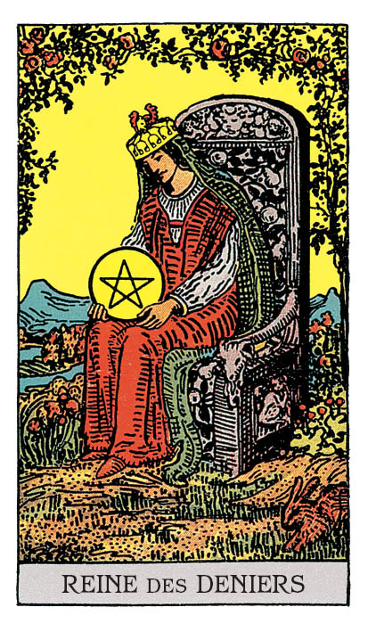

# Reine de Denier

## Signification

**Type de Carte :** Arcane Mineur de la Suite des Deniers, associée au monde matériel, à l'argent et aux possessions
**Élément :** Terre
**Numérologie / Rang :** Reine — la présence douce et rassurante, le féminin (Yin), la maîtrise subtile

## Description

La Reine de Denier est assise sur un trône richement décoré de fruits, de volutes et d'angelots. Comme pour L'Impératrice, la Nature autour d'elle est luxuriante. Parmi les fleurs, un lapin bondit à ses pieds. La Reine protège son Denier – symbole de matérialité et d'Abondance – par un geste tendre de la main.

## Mots-clés

### À l'endroit
- Ancrage
- Confort du foyer
- Personne qui prodigue amour et soins

### À l'envers
- Déséquilibre vie personnelle / professionnelle
- Avidité
- Difficultés financières, mauvaise gestion

## Interprétation

La Reine de Denier est probablement, dans le Tarot, la Reine la plus aimante et soignante, au sens maternel du terme. Elle est l'archétype de la femme au foyer qui crée, par ses actions au quotidien et son engagement, les conditions de la réussite pour ses proches. Elle est le collègue ou l'amie toujours pleine de ressources et de solutions "pratico-pratiques" à vos problèmes, la personne qui vous encourage et vous soutient dans les difficultés.

La Reine de Denier est un symbole de stabilité financière et de sécurité. Elle a construit cette Abondance grâce à une gestion efficace, une certaine discipline et une bonne hygiène de vie. Elle partage cette Abondance avec ses proches non pas pour les gâter mais pour leur donner une chance de déployer leur plein potentiel.

Dans un Tirage, la Reine de Denier apparait pour vous questionner sur votre rapport avec le plan matériel et l'argent en particulier. Générer des revenus, travailler, investir sont des actions importantes pour votre stabilité et votre avenir. Mais cela ne doit pas impacter négativement votre relation avec vos proches ni le temps que vous avez à consacrer à ceux que vous aimez – y compris vous-même !

La Reine de Denier vous invite également à vous comporter comme elle le ferait elle : agir avec compassion, ne pas chercher midi à quatorze heure et privilégier les solutions pratiques et simples à vos problèmes. Elle est une présence ingénieuse qui trouve en elle ou autour d'elle ce qui lui manque pour atteindre son objectif.

Enfin, comme toutes les Cartes de Cour, la Reine de Denier peut représenter une personne "de la vraie vie" dans votre entourage ou une personne que vous allez bientôt rencontrer. La Reine de Denier représente alors une personne pour qui la famille est une valeur essentielle. Satisfaite de sa vie et de ce qu'elle a construit pour elle et ses proches, cette personne aime la stabilité. Pragmatique et excellente gestionnaire, cette personne est également généreuse, dévouée et n'a pas peur de montrer ses sentiments.

## Reine de Denier et l'Amour

La Reine de Denier est parfaitement à l'aise seule et elle est très attachée à son indépendance. Comme elle, vous avez déjà tout ce qu'il faut autour de vous pour vivre une vie riche et épanouissante. Alors, si vous recherchez l'Amour, la personne qui vous convient le mieux est aussi une personne dont la vie est comblée et qui n'a pas besoin de vos richesses pour rendre sa vie attrayante ou avantageuse.

Si vous êtes en couple, la Reine de Denier est le signe que votre relation est solide et qu'elle a le potentiel pour être durable. La Reine de Denier aime son foyer, sa famille. C'est donc une excellente Carte s'il est question de mariage ou de fonder une famille.

Dans tous les cas, cette Reine exprime son Amour avec des attentions concrètes plutôt qu'avec des mots ou des gestes tendres. Sachez lire entre les lignes.

## Reine de Denier et le Travail

Vous avez envie d'un projet professionnel qui puisse assurer votre stabilité financière et générer des revenus d'un niveau satisfaisant.

A voir le magnifique jardin dans lequel est assise la Reine de Denier, vous pourriez en oublier le travail et les efforts qui lui ont permis d'arriver à une telle Abondance.

Ainsi, votre succès professionnel est lié à votre expérience, à votre ténacité et à la bonne réputation que vous avez construite au fur et à mesure de votre carrière – même si celle-ci est courte.

Prenez soin également de mettre en balance votre vie professionnelle et votre personnelle. Il ne servirait à rien de perdre sa vie à essayer de la gagner. Avant de vous surinvestir au travail, assurez-vous que vous-même et vos proches bénéficient de votre Energie.

## Reine de Denier et les Finances

Dans un Tirage concernant l'argent et les finances, la Reine de Denier représente une gestion minutieuse et très rigoureuse. Avec peu, elle est capable de créer beaucoup.

La Reine de Denier vous invite donc à investir avec soin et à faire grandir votre patrimoine dans la durée. Plutôt que de rechercher à gagner de l'argent rapidement ou de faire un "gros coup", attachez-vous à mener de façon très régulière de petites actions certes moins spectaculaires mais plus efficaces sur la durée.

## Reine de Denier et la Guidance

La Reine de Denier est apparue pour vous montrer comment l'Abondance, la générosité et la Gratitude sont à l'œuvre dans votre vie, dans votre quotidien.

Ces concepts spirituels peuvent paraître très déconnectés de votre vie de tous les jours. Pourtant, il ne faut pas avoir la sagesse de L'Hermite ou avoir suivi les enseignements du Hiérophant pour en faire l'expérience.

La Reine de Denier nous apprend que la spiritualité se vit "ici et maintenant", dans le quotidien. Pour elle, la Spiritualité n'est pas un état de perfection qu'il faudrait atteindre ou une récompense accordée plus tard ou ailleurs.

La Spiritualité se pratique dans tous les gestes, échanges et paroles de tous les jours. En vous occupant de vous et de vos proches, vous ressentez votre place dans le Monde, vous êtes connecté(e) Energétiquement aux autres, à la Nature et à l'Univers.

Comme la Reine de Denier, trouvez comment atteindre vos objectifs… mais sachez surtout pourquoi vous souhaitez les atteindre.

---

*Source : [Vivre Intuitif](https://vivre-intuitif.com/apprendre-le-tarot/signification/deniers/reine-de-denier/)*
*Illustration : Tarot de A.E. Waite — Rider-Waite-Smith*
