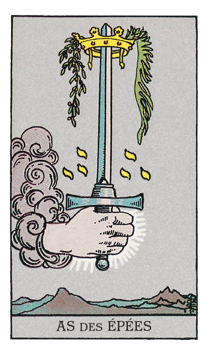

# As d'Épée

## Signification

**Type de Carte :** Arcane Mineur de la Suite des Épées associée aux idées, à la réflexion, au « mental » les grandes étapes ou leçons de la Vie
**Élément :** l'Air
**Numérologie / Rang :** 1, associé au commencement, aux opportunités

## Description

L'As d'Épée représente une main qui tient une grande épée. La main et l'épée semblent apparaître dans le Ciel « comme par Magie ». C'est l'Univers qui vous tend une épée, symbole de pensée et de réflexion. La lame de l'épée est ornée d'une couronne de lauriers, symbole de succès et de réussite. Comme sur la Carte de L'Hermite ou le Huit de Coupe, la montagne est présente. Elle représente le chemin solitaire de la réflexion, l'exploration intime qui permet à chacun de décider de sa voie.

## Mots-clés

### À l'endroit
- Nouvelle idée
- Réflexion, lucidité
- Pouvoir du mental

### À l'envers
- Manque de lucidité, jugement hâtif
- Réflexion bloquée
- Situation embrouillée

## Interprétation

Dans le Tarot, les As sont l'Énergie qui ouvre chacune des quatre Suites de Cartes Mineures du Tarot. Les As représentent le commencement d'une nouvelle voie, l'étincelle qui allume le feu de la nouveauté dans votre vie. Les As représentent également une nouvelle opportunité ou une nouvelle personne qui fait irruption dans votre vie. L'As d'Épée inaugure le cheminement à travers l'Énergie des Épées, c'est-à-dire l'Énergie du raisonnement, de la logique et du « mental ».

Contrairement à L'Hermite, l'As d'Épée n'est pas une Carte contemplative. Avec son Énergie, vous êtes plongé(e) au cœur de l'action ! Vous prenez les rennes ! L'As d'Épée est le mix d'idées nouvelles et d'actions innovantes que vous êtes capable de mettre en place pour atteindre vos objectifs.

Dans un Tirage, l'As d'Épée représente ou annonce un moment de grande lucidité sur votre situation, votre avenir ou vos espoirs. C'est un peu comme si une ampoule s'allumait au-dessus de votre tête. Qu'il s'agisse d'un objectif à atteindre, du rôle d'une personne dans votre vie, de votre vision du monde, vous voyez clair comme en plein jour et vous comprenez bien mieux votre situation. Le moment est donc choisi pour pousser vos réflexions plus loin, soit pour faire émerger les besoins de votre Être Authentique soit pour imaginer le chemin à suivre pour les combler.

Ce moment de lucidité peut avoir des côtés inconfortables… car toutes les vérités ne sont pas agréables à découvrir ou à exprimer. L'Épée est aussi une arme, un symbole guerrier. Il est possible que vous ayez à vous battre ou à défendre votre point de vue, vos droits ou votre rêve. Votre lucidité d'esprit sur la situation vous donne une longueur d'avance sur vos opposants. Utilisez-la à bon escient.

## As d'Épée et l'Amour

Si vous recherchez l'Amour, l'As d'Épée est apparu pour vous conseiller d'utiliser une approche réfléchie et rationnelle pour trouver la bonne personne. Vous préféreriez sans doute que les choses soient simples, sentimentales et romantiques… et elles peuvent le devenir ! Mais avant d'en arriver là, utilisez l'Énergie de l'As d'Épée pour être au clair sur ce que vous attendez de votre partenaire, quel type de personne vous souhaitez rencontrer et quel type de personnalité vous souhaitez éviter. Avec ces qualités et ces limites posées mentalement, il vous sera bien plus facile de reconnaître la personne qui pourra vous convenir. Ensuite, toujours dans cette Énergie d'analyse des Épées, demandez-vous où et comment vous pouvez rencontrer des personnes qui correspondent à votre recherche.

Si vous êtes en couple et que vous connaissez des difficultés, vous avez besoin de renouveler le regard que vous portez sur votre relation. Vous avez besoin d'analyser la situation, de réfléchir à votre positionnement dans la relation et à celui de votre partenaire. Identifiez ce qui ne « colle pas » – ou ne « colle plus » – et imaginez une nouvelle approche pour résoudre ces difficultés. Soyez créatif, pensez hors des sentiers battus et ne censurez pas une solution potentielle sous prétexte que votre partenaire ne voudra jamais essayer. C'est le moment de faire différemment et de se montrer innovant(e). Ouvrez le dialogue avec vos idées et mettez votre partenaire à contribution. Cette réflexion commune et la mise en œuvre des solutions qui en découlent peuvent consolider votre couple.

## As d'Épée et le Travail

Dans un Tirage concernant le travail ou votre avenir professionnel, l'As d'Épée vous invite à mettre en place la formule suivante : nouvelle idée + focalisation sur sa mise en œuvre = un projet sur les rails de la réussite ! L'As d'Épée indique que vous avez la lucidité et la motivation pour faire advenir vos excellentes idées professionnelles.

L'As d'Épée peut indiquer un changement prochain de votre situation professionnelle parce que vous avez besoin de mieux mettre à profit votre matière grise. Vos connaissances approfondies dans votre domaine, votre expérience et vos compétences d'analyse et de réflexion sont recherchées. N'hésitez pas à créer l'opportunité si elle tarde à se manifester. Poussez les portes. Tenez-vous prêt(e) à expliquer de façon claire et structurée ce que vous aimeriez mettre en place, le type de mission que vous aimeriez vous voir confier et quel plan d'action vous pourriez mettre en œuvre.

## As d'Épée et les Finances

Dans le domaine des finances et concernant l'argent, l'As d'Épée indique que vous devez aborder votre situation financière différemment. Si vous avez des difficultés financières, il y a fort à parier que ce que vous faites ou ce que vous avez fait jusque là ne fonctionne pas ou pas suffisamment bien. N'en soyez pas heurté(e) mais au contraire, utilisez cette connaissance pour porter un regard plus lucide sur vos finances et trouver des solutions qui vous permettent de vous remettre à flot. La démarche est difficile, voire douloureuse, mais les petits pas, les petits changements maintenus dans le temps vous permettront d'obtenir des résultats notables et durables.

## As d'Épée et la Guidance

L'As d'Épée représente la petite ampoule qui s'allume au-dessus de votre tête. Dans votre cheminement spirituel, les choses commencent à s'emboîter de façon logique. Vous commencez à ressentir votre place dans l'Univers, à comprendre comment les pratiques Intuitives et Énergétiques fonctionnent et ce qu'elles peuvent vous apporter.

C'est un moment magique ! L'étincelle est allumée en vous. Qui sait quelle ampleur pourrait prendre ce brasier ? Qui sait jusqu'où vous pourriez aller dans la découverte de vous-même, des besoins de votre Être Authentique ? Ne vous arrêtez pas en si bon chemin !

L'As d'Épée est aussi une Carte d'action. Profitez de son Énergie pour transformer votre envie de spiritualité en actions, Rituels et expérimentations au quotidien.

---

