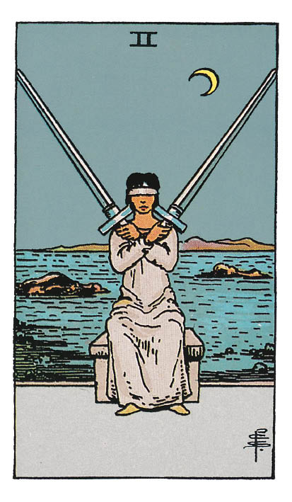

# Deux d'Épée

## Signification

**Type de Carte :** Arcane Mineur de la Suite des Épées associée aux idées, à la réflexion, au « mental » les grandes étapes ou leçons de la Vie
**Élément :** l'Air
**Numérologie / Rang :** 2, associé aux choix, à l'équilibre, au couple

## Description

Le Deux d'Épée est une Carte que l'on peut interpréter intuitivement assez facilement parce que l'illustration proposée dans le Tarot de Waite « classique » correspond bien au sens conventionnel de la Carte. Une femme tient dans ses mains deux Épées – c'est-à-dire deux pensées, deux idées, deux possibilités. Ses yeux sont bandés. Elle ne peut donc pas « voir » quelle possibilité est la meilleure. Elle est assise sous la Lune… Son intuition aurait-elle un rôle à jouer dans sa décision ? En tous les cas, il va falloir la prendre vite car elle ne pourra tenir ses Épées à bout de bras indéfiniment…

## Mots-clés

### À l'endroit
- Indécision, blocage
- Réflexion avant d'agir
- Compromis à trouver

### À l'envers
- Lucidité
- Décision évidente
- « Ca avance » enfin !

## Interprétation

Avec cette Carte, on peut imaginer que le Consultant soit tiraillé entre deux possibilités ou que le Consultant cherche à réconcilier deux forces opposées dans sa vie. En tous les cas, la posture peut être assez inconfortable et une décision doit être prise.

La présence de la Lune, symbole de l'intuition, laisse penser que l'intuition doit être mise à contribution dans le processus de décision. L'intuition complète les pensées « logiques » et « mentales » symbolisées par la Suite des Épées.

Avec le Deux d'Épée, il est conseillé de prendre son temps, de ne pas prendre de décision hâtive ou sur un coup de tête. Il faut prendre son temps ; l'introspection est nécessaire.

## Deux d'Épée et l'Amour

En Amour, le Deux d'Épée indique que le Consultant hésite entre deux personnes ou entre deux possibilités – comme par exemple « partir » ou « rester » dans sa relation. C'est une décision qu'il ou elle essaie de prendre depuis « un certain temps » sans y parvenir. Cela commence à lui peser.

Le Deux d'Épée vient dire au Consultant : « Inutile d'essayer de prendre cette décision de façon rationnelle car en Amour, rien n'est vraiment rationnel ! ». Dans le Domaine Amoureux, l'intuition et la connaissance intime de soi ont toute latitude pour s'exprimer. D'ailleurs, il est possible que le Consultant connaisse déjà sa réponse dans son fort intérieur.

Si la relation amoureuse du Consultant a été « tendue » ces derniers temps, le Deux d'Épée indique que travailler au compromis pour retrouver l'équilibre est une option à explorer, à tenter.

## Deux d'Épée et le Travail

Dans le contexte d'un Tirage sur le Travail, le Deux d'Épée indique que l'indécision est telle que le Consultant s'en trouve bloqué. Le Consultant est pris entre deux feux et dans l'incapacité de trancher, même si c'est justement ce qui lui est demandé.

Si le Consultant ne « sent pas » les options qui s'offrent à lui, c'est peut-être parce qu'une troisième voie doit être trouvée. Y a-t-il une possibilité de mettre tout le monde d'accord ? Quel serait le meilleur compromis ? Quelle solution bénéficierait au plus grand nombre ?

Attention à ce que le Consultant ne « fasse pas l'autruche ». Parfois, une décision est difficile à prendre mais… si c'est la bonne pour le bien de sa carrière, de son projet ou de son entreprise… il faut prendre ses responsabilités et assumer.

## Deux d'Épée et les Finances

Peut-être moins évidente à interpréter dans le Domaine des Finances, il n'en demeure pas moins que le Deux d'Épées met en garde contre les décisions hâtives. Dans ce Domaine, comme pour les autres, le Deux d'Épée indique le besoin de réfléchir avec soin aux possibilités offertes au Consultant, afin que la meilleure soit choisie.

Prendre son temps est conseillé. Se renseigner auprès des experts du Domaine également – conseiller bancaire, notaire, expert comptable, c'est selon… Rien ne presse.

## Deux d'Épée et la Guidance

Le Deux d'Épée symbolise un état d'équilibre bientôt rompu par une prise de décision.

Quelle est cette situation initiale pour vous ? Quel équilibre vous procure-t-elle ?

Quelle est cette décision que vous hésitez à prendre ? Quels sont les bénéfices que vous pourriez trouver dans la nouvelle situation créée ?

Si vous n'êtes pas prêt(e) à prendre votre décision, alors il est sans doute plus sage d'attendre encore un peu.

Un signe pourrait venir conforter vos ressentis et vous amener dans la bonne direction.

---

