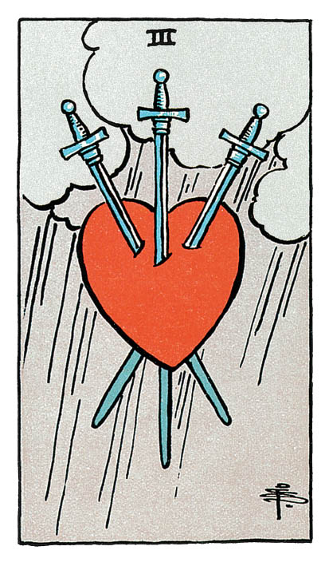

# Trois d'Épée

## Signification

**Type de Carte :** Arcane Mineur de la Suite des Épées associée aux idées, à la réflexion, au « mental » les grandes étapes ou leçons de la Vie
**Élément :** l'Air
**Numérologie / Rang :** 3, se confronter à la réalité

## Description

Le Trois d'Épée représente un cœur, comme suspendu dans les airs et transpercé par trois épées. Le cœur est le symbole de l'amour et de la sensibilité. Les Épées représentent la capacité de la logique ou du mental de blesser le corps ou les émotions d'une personne. Le ciel est couvert ; la pluie tombe en un épais rideau comme pour symboliser un « coup dur ».

## Mots-clés

### À l'endroit
- Séparation douloureuse
- Chagrin, douleur, peine de cœur
- Se sentir rejeté, pas à sa place

### À l'envers
- Se reconstruire après un événement douloureux
- Lâcher-prise sur sa douleur
- Pardonner, se réconcilier

## Interprétation

Le Trois d'Épée est une Carte douloureuse qui représente la solitude, la tristesse, une peine de cœur ou encore une trahison.

Ces moments difficiles et les émotions douloureuses associées font malheureusement partie intégrante de la vie. La douleur permet d'apprendre, de grandir et de ne pas reproduire les mêmes erreurs. Elle peut aussi être une source de motivation. Le Trois d'Épée rappelle que si le Consultant arrive à percevoir ce moment comme une opportunité de développement personnel, il ou elle vivra cette épreuve plus facilement, en lui donnant du sens.

Le Trois d'Épées exprime également la nécessité pour le Consultant de lâcher prise. Le Consultant vient de vivre une perte ou une déconvenue majeure. Il est temps de pleurer, de ressentir pleinement la douleur, pour être en mesure de la relâcher et d'avancer. Exprimer sa tristesse aide à « tout sortir » et à alléger son cœur. Le Consultant doit prendre garde à ne pas s'enfermer dans sa douleur et doit tout mettre en œuvre pour assurer sa guérison émotionnelle.

## Trois d'Épée et l'Amour

Dans un Tirage au sujet de l'Amour, le Trois d'Épée représente en général une peine de cœur. Le Consultant a « le cœur qui saigne » ; il ou elle ressent une grande douleur émotionnelle et de la déception. Il est possible également que le Consultant soit à l'origine de cette douleur chez le partenaire, en étant à l'origine de la rupture par exemple.

Si le Consultant recherche l'Amour, le Trois d'Épée indique que la personne est encore en prise avec ses peines de cœur passées. Cela l'empêche d'avancer sereinement et de trouver l'amour aujourd'hui. Le Trois d'Épée conseille de guérir émotionnellement de ces relations antérieures avant d'espérer entamer une relation qui puisse répondre à ses attentes.

Si le Consultant est actuellement en couple, le Trois d'Épée indique une rupture, une « coupure ». Des mots durs ont été échangés, l'un à fait souffrir l'autre. La confiance est mise à rude épreuve dans le couple. Le résultat ? Une grande douleur morale qui nécessite de guérir avant toute prise de décision ou toute action.

## Trois d'Épée et le Travail

Dans le domaine professionnel, le Trois d'Épée indique une « perte » : perte de son emploi, perte de salaire, un projet raté ou encore une opportunité qui ne s'est pas concrétisée. Le Consultant vit mal cette défaite personnelle et se sent très dévalorisé. Le Trois d'Épée conseille de prendre du recul et d'envisager comment rebondir. Le travail est un élément – certes important – de la vie mais le Consultant a aussi sa famille, ses proches, sa vie personnelle pour se rebooster et se sentir aimé et/ou utile.

## Trois d'Épée et les Finances

En ce qui concerne l'argent et les finances, le Trois d'Épée peut représenter ou mettre en garde contre une perte d'argent imprévue et soudaine. Des actions qui perdent de leur valeur, un vol ou des dettes qui s'accumulent mettent le budget du Consultant à rude épreuve. Le Trois d'Épée conseille de vérifier que les possessions matérielles du Consultant soient bien sécurisées et assurées.

## Trois d'Épée et la Guidance

Vous vivez une période difficile et douloureuse. Quelqu'un ou quelque chose vous manque pour vous sentir contentée et heureuse. Utilisez cette douleur comme une opportunité de mieux vous connaître et de grandir spirituellement. Le moment est difficile mais il ne durera pas éternellement. Une fois cette période traversée, vous vous sentirez plus forte, encore plus capable d'affronter les tempêtes de la vie. Qu'est-ce qui, ici et maintenant, pourrait vous faire du bien ? Prenez de temps pour vous pour ressentir du bien-être, pour guérir émotionnellement. Si nécessaire, parlez de votre tristesse et de ce qui vous fait mal à un proche de confiance.

---

*Source : [Vivre Intuitif](https://vivre-intuitif.com/apprendre-le-tarot/signification/epees/le-trois-epee/)*
*Illustration : Tarot de A.E. Waite — Rider-Waite-Smith*
