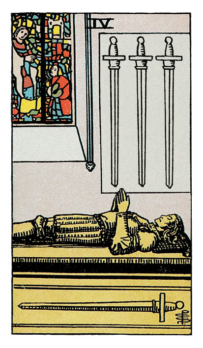

# Quatre d'Épée

## Signification

**Type de Carte :** Arcane Mineur de la Suite des Épées associée aux idées, à la réflexion, au « mental » les grandes étapes ou leçons de la Vie
**Élément :** l'Air
**Numérologie / Rang :** 4, associé à la stabilité, aux fondations

## Description

Le Quatre d'Épée représente un gisant, la statue funéraire d'un chevalier posée sur sa tombe. Le cénotaphe se trouve dans une Église dont un des vitraux est représenté. Les mains de la statue sont jointes, en prière. Trois épées pointent vers la statue tandis que la quatrième est représentée sur la tombe. Calme et solennité se dégagent de l'illustration.

## Mots-clés

### À l'endroit
- Réflexion calme, méditative
- Repos, relaxation
- Se concentrer sur une seule chose à la fois

### À l'envers
- Anxiété, stress
- Agitation, trop d'idées à la fois
- Dispersion de l'Énergie

## Interprétation

Après les décisions difficiles à prendre illustrées par le Deux d'Épée et la profonde tristesse évoquée par le Trois d'Épée, le Quatre d'Épée offre un repos bien mérité et un temps de récupération aussi bien mentale que physique et émotionnelle. Vous avez besoin de ce temps pour panser vos blessures, qu'elles soient la conséquence d'une rupture amoureuse, d'un traumatisme ou de soucis financiers. Vous êtes fragile actuellement et il serait imprudent de prendre des décisions impactantes.

Ce repos, vous devez le prendre seul(e) et vous servir de ce temps de répit pour vous isoler des influences extérieures. Il est essentiel que vous puissiez vous retrouver vous, mettre vos mots sur vos émotions et articuler vos pensées – sans ressentir de pressions externes. Cet isolement calculé est nécessaire pour que vous puissiez (re)trouver en vous l'Énergie d'aller de l'avant et (re)trouver en vous le sens que vous souhaitez donner à vos projets, à votre vie. Tel un joueur d'Échecs, vous découvrez quel est le prochain coup vous devez jouer pour gagner. Et quand vous serez prêt(e) à vous remettre dans la course, ce moment de rétablissement vous aura permis de reconstituer une immense force pour avancer.

Le côté « à double tranchant » du Quatre d'Épée est que vous pouvez vous attendre à ce que les challenges, voire les difficultés, soient de retour dans votre vie… mais pas avant que vous soyez prêt(e) à les affronter. Vous avez donc encore du chemin à parcourir, encore quelques batailles à livrer. Pour l'instant, profitez pour respirer, méditer, prendre du temps pour vous. Profitez de ce moment de répit et de calme pour vous préparer à la suite.

## Quatre d'Épée et l'Amour

L'Énergie du Quatre d'Épée s'inscrit dans la continuité de celle du Trois d'Épée, la Carte des peines de cœur et du chagrin. Après avoir connu cette douleur, il est normal de souhaiter panser ses plaies, comme un petit animal blessé.

Si vous recherchez l'Amour, le moment n'est pas encore venu de chercher à faire activement des rencontres. Prenez soin de vous. Pensez à vous. Dans ce moment de solitude, pensez aux attitudes ou habitudes que vous avez tendance à répéter dans vos relations et qui vous desservent. Donnez-vous du temps de guérir émotionnellement des blessures de votre passé amoureux. Ce travail vous permettra d'aller en toute confiance à la rencontre de l'autre quand vous y serez prêt(e).

Si vous êtes en couple, vous avez besoin de souffler. Ce besoin ne vient pas nécessairement de votre relation mais les circonstances actuelles font que vous avez besoin de temps pour vous. Vous avez besoin de vous retirer et d'économiser votre Énergie. Trouvez les mots pour l'expliquer à votre partenaire sans blesser ni briser la communication. Vous avez besoin de vous retrouver pour être capable de retrouver votre partenaire par la suite.

## Quatre d'Épée et le Travail

Dans un Tirage concernant le travail ou votre avenir professionnel, le Quatre d'Épée est une Énergie de calme et de repos.

Si vous recherchez du travail, la présence du Quatre d'Épée indique que le marché du travail ou votre secteur d'activité est particulièrement calme actuellement. Vous devez prendre votre mal en patience et surtout ne pas vous décourager.

Si vous êtes en poste, les évolutions positives pour votre carrière se font attendre, même si votre rythme de travail, lui, est soutenu ! C'est sans doute le moment de réfléchir à comment réaliser le changement que vous aimeriez accomplir, que cela soit en terme de responsabilités, de gain de salaire ou d'équilibre vie personnelle / vie professionnelle. Reprenez un peu d'Énergie dédiée au travail pour vous-même et pensez « stratégie ». Que souhaitez-vous accomplir ? Comment pouvez-vous y arriver ? Un changement d'entreprise serait-il nécessaire ? Au besoin, prenez le temps de faire un point complet via un accompagnement personnalisé ou un bilan de compétences.

## Quatre d'Épée et les Finances

Dans le domaine des finances et concernant l'argent, le Quatre d'Épée indique que vous avez besoin de temps et de recul pour bien évaluer votre situation financière.

Ce processus est difficile car vous devez plonger en vous pour comprendre votre relation à l'Abondance et à l'argent. Vous devez comprendre ce que l'argent veut dire pour vous, comment vous le dépensez et comment vous pourriez atteindre la stabilité financière pour ne plus être angoissé(e) à ce sujet.

Cette réflexion intime est la première étape pour reprendre les rennes et vous remettre à flot.

## Quatre d'Épée et la Guidance

Le tourbillon du quotidien invite immanquablement les imprévus, le stress et la fatigue dans votre vie. Le Quatre d'Épée vous invite à faire une pause bien méritée pour recharger vos batteries spirituelles, intellectuelles et émotionnelles.

Quel est le meilleur moyen pour vous d'y parvenir ? Quel est le meilleur moyen pour vous de retrouver ancrage et sérénité ?

La tranquillité de la méditation, la lucidité d'un Tirage de Tarot, l'Énergie apaisante de votre Pierre préférée dans le creux de votre main sont autant de possibilités pour retrouver le calme et la quiétude.

N'attendez pas de vous sentir à bout pour en profiter.

---

*Source : [Vivre Intuitif](https://vivre-intuitif.com/apprendre-le-tarot/signification/epees/quatre-epee/)*
*Illustration : Tarot de A.E. Waite — Rider-Waite-Smith*
