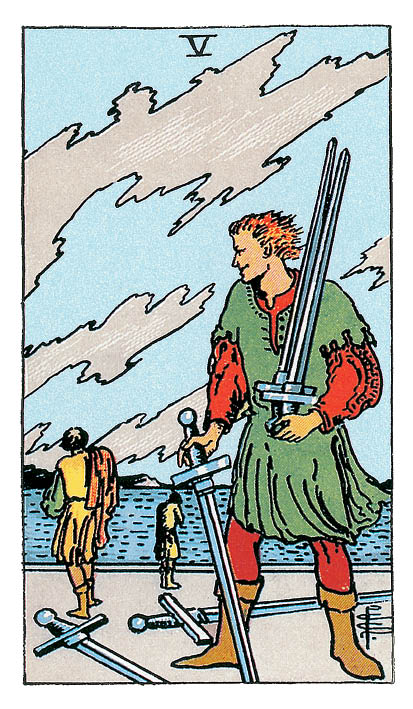

# Cinq d'Épée

## Signification

**Type de Carte :** Arcane Mineur de la Suite des Épées associée aux idées, à la réflexion, au « mental » les grandes étapes ou leçons de la Vie
**Élément :** l'Air
**Numérologie / Rang :** 5, associé aux difficultés

## Description

Le Cinq d'Épée montre un jeune homme qui regarde d'un air méprisant s'éloigner au loin ses ennemis vaincus. Il tient dans ses bras les Épées qu'il a remportées au combat. Les deux vaincus s'éloignent lentement et il se dégage de la Carte un sentiment de perte et de tristesse. Le ciel est nuageux, chargé, ce qui laisse à penser que si la bataille est finie, le calme n'est pas encore totalement revenu.

## Mots-clés

### À l'endroit
- Hostilité
- Malhonnêteté
- Trahison

### À l'envers
- Se faire prendre
- Sortir d'une crise, d'un conflit
- Situation qui se débloque

## Interprétation

Le Cinq d'Épée indique que le Consultant est en conflit et en désaccord avec une ou plusieurs personnes de son entourage et que cela provoque tension et stress. Même si le Consultant pense « gagner cette bataille », il ou elle sera peut-être perdant sur le moyen terme car le conflit a dégradé la communication et les relations entre les personnes concernées. Le Consultant a pu les blesser par ses paroles ou ses actes. La confiance est perdue. Le Consultant doit décider s'il souhaite rester sur sa position et risquer d'envenimer encore plus le conflit ou s'il veut mettre de l'eau dans son vin pour sauver ce qui peut l'être et réparer la relation.

Le Cinq d'Épée représente aussi l'ambition dans ce qu'elle a de plus négatif, c'est-à-dire une ambition démesurée, égoïste, qui implique d'écraser les autres pour réussir. Le Consultant peut être l'initiateur ou la victime d'une telle ambition destructrice. Dans les deux cas, le Consultant apprendra à ses dépends que le prix de la victoire est parfois amer.

Le Cinq d'Épée est souvent associé à une trahison, une « attaque surprise » par quelqu'un à qui le Consultant fait confiance et qui n'a jamais été considéré comme un ennemi. Il peut s'agir du partenaire du Consultant, d'un ami proche, d'un membre de sa famille ou de son entourage professionnel. Les autres Cartes du Tirage donnent des indications sur la provenance et la nature de la trahison. Le Consultant doit être très prudent et redoubler de vigilance.

Enfin, le Cinq d'Épée peut symboliser la défaite. Malgré de gros efforts, le Consultant est battu, vaincu. Il faut accepter la défaite, en tirer les conséquences et apprendre de cet échec. Le Consultant ne doit pas se laisser abattre. Au contraire ! C'est une chance de mettre en place ce qui mènera à la réussite.

## Cinq d'Épée et l'Amour

Si le Consultant recherche l'Amour et que le Cinq d'Épée apparaît dans le Tirage, cela signifie qu'il ou elle n'a pas encore trouvé son Âme Sœur et que son histoire amoureuse est difficile. Le Consultant a le sentiment de se faire toujours avoir, d'être toujours blessé par l'autre, rejeté, mal aimé. Il est possible que le Consultant soit trop « doux » et se plie sans arrêt aux désirs des autres… ou au contraire que le Consultant soit trop insistant auprès des partenaires potentiels. Quoi qu'il en soit, un équilibre doit être trouvé et une nouvelle stratégie doit être mise en place pour lever les blocages.

Si le Consultant est actuellement en couple, le Cinq d'Épée indique que la relation est en difficulté, que les conflits se multiplient et que la tension monte. Il faut que les partenaires s'acceptent avec bienveillance et s'écoutent. Des paroles dures et blessantes ont sans doute été échangées. Si le Consultant souhaite réparer la relation, il faut pardonner, communiquer, et repartir sur de bonnes bases. Cela veut dire accepter la responsabilité de ses actes, faire amende honorable, demander pardon… et accepter les excuses de l'autre et lui pardonner.

## Cinq d'Épée et le Travail

Dans le domaine professionnel, le Cinq d'Épée indique que le Consultant évolue dans un environnement difficile, où la compétition et les coups bas règnent. C'est un monde de requins, dans lequel la pression est forte. Le Consultant doit protéger ses intérêts, se protéger… et naviguer avec prudence dans cet environnement où les jeux de pouvoir et les « petites guerres » font forcément des gagnants et des perdants.

Si le Consultant recherche du travail, le marché est difficile, beaucoup de candidats se bousculent pour peu de places. Trouver « le » poste idéal rapidement pourrait être vraiment compliqué. Il est peut-être même nécessaire de se rabattre sur un emploi alimentaire et temporaire. Dans tous les cas, le Consultant doit continuer à mettre toutes les chances de son côté et rester au sommet de sa forme pour décrocher un poste.

## Cinq d'Épée et les Finances

En ce qui concerne l'argent et les finances, le Cinq d'Épée est lié au vol et à la trahison. Si le Consultant doit prendre une décision financière importante, il faut s'assurer que la situation soit bien « saine ». Il pourrait y avoir « tromperie sur la marchandise ». Si l'occasion paraît trop belle pour être vraie, il faut exercer la plus grande prudence et demander l'avis d'un professionnel.

Si le Consultant s'inquiète, si l'attitude d'une personne de son entourage lui paraît suspecte… prudence ! Il peut se tramer des choses dans son dos.

## Cinq d'Épée et la Guidance

Votre temps et vos ressources énergétiques ne sont pas infinies. Alors, quelles « batailles » allez-vous choisir ? Vous êtes parfois tentée de vous battre sur les petites choses, de montrer aux autres que vous avez raison, de vous défendre quand vous vous sentez jugée ou intimidée par une autre personne ? Il est parfois préférable de rendre les armes et de traiter au maximum vos amis, vos collègues, vos proches avec compassion et bienveillance. L'autre n'est pas d'accord avec vous… mais cela fait-il de lui pour autant un ennemi ? Pourquoi est-ce si important d'avoir raison face à lui ? Est-ce l'Égo qui parle ?

Le Cinq d'Épée vous rappelle à la difficile tâche de l'introspection : regarder ses propres comportements négatifs – car nous en avons tous – et accepter cette part d'ombre, cette part d'Égo, qui fait partie de soi. La connaître est essentiel pour s'accepter soi complètement… et évoluer si besoin.

---

