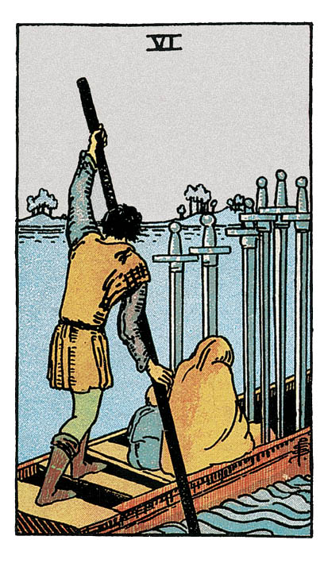

# Six d'Épée

## Signification

**Type de Carte :** Arcane Mineur de la Suite des Épées associée aux idées, à la réflexion, au « mental » les grandes étapes ou leçons de la Vie
**Élément :** l'Air
**Numérologie / Rang :** 6, associé à la sécurité et à l'harmonie

## Description

Une femme et un enfant sont transportés en barque par un homme. La femme et l'enfant sont serrés l'un contre l'autre, couverts, presque cachés. Les trois personnages sont vus de dos, ce qui évoque une fuite discrète plutôt qu'un voyage joyeux. À droite de la barque, l'eau est agitée alors qu'à gauche de la barque – vers la rive que l'embarcation cherche à atteindre – les flots sont calmes. Ce contraste symbolise d'une part la situation difficile que les personnages quittent et d'autre part l'espoir de reconstruire une vie meilleure sur l'autre rive. Dans cette reconstruction, les idées, le mental jouent un rôle prépondérant comme le montrent les six Épées toutes droites dans la barque.

## Mots-clés

### À l'endroit
- Quitter une situation difficile
- Progresser, avancer vers son objectif
- Transition, rite de passage

### À l'envers
- Résister au changement, se figer de peur
- Être retenu par quelque chose ou quelqu'un
- Revenir au point de départ

## Interprétation

Après la défaite et les difficultés symbolisées par le Cinq d'Épée, le Six d'Épée indique que vous êtes prêt(e) à lâcher-prise sur le chagrin et les regrets pour embarquer vers une nouvelle vie, de nouveaux objectifs.

Si vous n'arrivez pas encore tout à fait à faire face à la situation, vous voyez les choses pour ce qu'elles sont et pas pour ce que vous aimeriez qu'elles soient. Même si la vérité est douloureuse, vous avez réussi à l'accepter pour avancer à nouveau. Vous aspirez à ce renouveau, même si vous ne savez pas complètement de quoi il sera fait.

Mais « aller de l'avant » ne veut pas dire « oublier ». Vous laissez derrière vous une partie importante de votre vie. Vous ressentez des regrets, de la tristesse et vivez ce départ forcé d'abord comme une véritable perte. Le Six d'Épée indique que bientôt chagrin et peine seront remplacés par une plus grande lucidité et un soulagement car vous aurez pleinement accepté le changement.

En ce sens, le Six d'Épée est, comme L'Étoile, une Carte remplie d'espoir. Elle indique que vous êtes embarqué(e) vers un futur meilleur, une position plus enviable. Il ne faut donc pas s'attarder sur le passé et ce que vous avez quitté mais voir loin, vous projeter dans un avenir qui reste à construire… et pour lequel ces difficultés vous ont préparé(e). C'est le moment de changer l'opinion que vous avez de vous-même, d'abandonner vos pensées limitantes et d'avancer vers la réalisation de votre Être Authentique.

De façon plus littérale, le Six d'Épée peut annoncer un voyage ou un déménagement notamment si l'Eau y est associée sous la forme d'un océan, d'un lac ou d'une rivière. Ce « voyage sur l'eau » ou « au-delà de l'eau », même s'il se fait avec un pincement au cœur, vous fera le plus grand bien et le changement procuré sera fort salutaire – notamment en terme de découverte de soi.

## Six d'Épée et l'Amour

Dans un Tirage concernant l'Amour, les relations amoureuses, l'Énergie du Six d'Épée s'inscrit dans la continuité de celle du Trois d'Épée, la Carte des peines de cœur. Après avoir perdu l'amour, il faut être capable de tourner la page et d'avancer.

Pour cela, vous devez laisser derrière vous votre manque d'assurance, vos angoisses et ne gardez de votre expérience passée que ce qui peut vous servir à être toujours plus Authentique – notamment dans votre relation à l'autre.

Si vous êtes à la recherche de l'amour, faire une belle rencontre est possible. Vous ne devez pas avoir peur d'embarquer pour naviguer à sa rencontre. Votre future relation sera bien plus satisfaisante que vous ne pouvez l'imaginer actuellement. Lâchez-prise sur vos expériences amoureuses passées pour laisser la place au renouveau et à ce nouvel amour. N'ayez pas peur de sortir de votre zone de confort pour aller à la rencontre de l'autre.

Si vous êtes en couple, vous devez également lâcher-prise sur votre histoire passée et décider de « réembarquer » ensemble, de naviguer vers votre destination de couple. Pardonnez à votre partenaire. Pardonnez-vous. Saisissez ensemble la chance de redémarrer et de reconstruire une relation plus profonde, plus belle… et laissez les difficultés passées derrière vous.

Parfois, le Six d'Épée indique qu'une séparation temporaire est nécessaire. Ce break permettra à vous et à votre partenaire de réfléchir à ce qui est essentiel pour chacun dans le couple et comment reprendre la route ensemble.

## Six d'Épée et le Travail

Dans un Tirage concernant le travail ou votre avenir professionnel, le Six d'Épée représente un changement nécessaire même s'il est douloureux.

Quand il est subi, le Six d'Épée peut donc représenter un licenciement, un refus d'embauche, la perte d'un client…. Toutefois, aussi pénible soit-elle, cette perte laisse en réalité place à une opportunité plus intéressante encore.

Quand il est choisi, le Six d'Épée représente un changement de carrière, quitter sa situation actuelle dans le but d'atteindre des objectifs professionnels plus ambitieux ou plus alignés avec vos valeurs. Vous mesurez bien le risque à prendre. Vous avez conscience de ce que vous abandonnez pour aller chercher mieux sur l'autre rive. Ce changement vous attire aussi fort qu'il vous fait peur. Tout ne se fera pas en un jour. Donnez du temps à votre transformation et mesurez la prise de risque à chaque étape.

## Six d'Épée et les Finances

Dans le domaine des finances, le Six d'Épée indique que votre situation financière est en train de changer. Vous avez sans doute encore quelques sacrifices à faire et cela vous pèse ou vous frustre.

Toutefois, vous êtes embarqué(e) pour une destination – une meilleure situation financière – que vous pouvez atteindre. Il serait dommage de lâcher votre objectif maintenant et perdre le bénéfice du travail déjà accompli pour l'atteindre.

## Six d'Épée et la Guidance

Lâcher-prise sur le passé. Se libérer pour avancer vers plus d'Authenticité. Cette idée est présente dans plusieurs Cartes du Tarot. Le Cinq de Coupe, le Huit de Coupe ou encore Le Diable évoquent les degrés divers de chagrin et de difficultés associés à cet exercice douloureux mais tellement nécessaire.

La libération dont parle le Six d'Épée concerne vos idées et vos représentations mentales. Douloureuse, elle vous permet d'atteindre un niveau supérieur de conscience, de compréhension de soi, des autres et du monde.

Abandonner vos représentations mentales est difficile et douloureux car cela donne l'impression de remettre en question toute votre existence. Et puis, cela crée un vide… Par quoi les remplacer ?

En réalité, ce processus n'est pas brutal. Il s'agit d'une transition, d'un changement qui n'est jamais terminé et dont vous ferez l'expérience toute votre vie. Vous avez déjà vécu de telles transitions par le passé et vous avez, sans aucun doute, aidé d'autres personnes à vivre les leurs. Laissez-vous embarquer. Utilisez votre Intuition comme boussole. Elle vous aidera à mener votre barque au port de votre choix jusqu'au prochain voyage.

---

