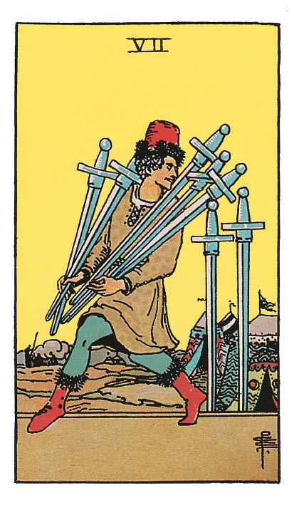

# Sept d'Épée

## Signification

**Type de Carte :** Arcane Mineur de la Suite des Épées associée aux idées, à la réflexion, au « mental » les grandes étapes ou leçons de la Vie
**Élément :** l'Air
**Numérologie / Rang :** 7, associé à la sagesse intérieure et à l'acceptation de ses messages

## Description

Un drôle de personnage s'éloigne à pas de loup d'un camp militaire. Il a les bras chargés de cinq épées. Il laisse derrière lui deux épées plantées dans le sol qu'il regarde avec convoitise parce qu'il n'a pas pu les emmener avec lui. Son sourire narquois indique qu'il est fier de son vol et ne s'attend pas à être pris la main dans le sac. Toutefois, sa victoire est de courte durée. Un groupe de soldats, représenté à l'arrière-plan, est déjà sur ses traces.

## Mots-clés

### À l'endroit
- Mensonges, arnaque, trahison
- Vol, activités répréhensibles
- Faire semblant

### À l'envers
- Découvrir une vérité
- Se faire prendre, être démasqué
- Demander pardon, se réconcilier

## Interprétation

Le Sept d'Épée est une Énergie qui évoque le vol, la tromperie et les mensonges. Quand elle apparaît dans un Tirage, elle peut vous mettre en garde contre des activités dissimulées, des propos tenus dans votre dos, des cachoteries qui peuvent aller jusqu'à l'infidélité ou l'abus de confiance.

Quand le Sept d'Épée apparaît dans un Tirage, vous devez faire attention aux intentions de votre entourage par rapport à vous. Il est possible que quelqu'un cherche à se servir de vous, à vous faire une crasse ou à vous embarquer dans une activité louche. Soyez sur vos gardes et faites confiance à vos ressentis quant à l'attitude des uns et des autres.

Le Sept d'Épée peut également indiquer que vous êtes à l'origine de la tromperie et que vos actions sont douteuses. Il est possible que vous tentiez de fuir vos responsabilités ou de prendre des raccourcis vers l'atteinte de vos objectifs. Soyez toujours en capacité d'avoir bonne conscience et d'agir aligné(e) avec votre Être Authentique. La facilité n'est pas toujours le chemin le plus sûr vers le succès.

Le Sept d'Épée est souvent confondu avec le Cinq d'Épée parce que l'illustration des deux Cartes et leur Énergie se ressemblent. Les deux Cartes ont en commun la notion de « vol » mais elle s'exprime différemment dans les deux Cartes. Le Cinq d'Épée cherche à nuire, à détruire tandis que le Sept d'Épée, bien que sournois, cherche à survivre. Il peut se cacher derrière ses faits et gestes un vrai besoin ou une vraie détresse.

## Sept d'Épée et l'Amour

Dans un Tirage concernant les relations amoureuses, le Sept d'Épée n'est pas une Carte des plus réjouissante. Elle indique un certain degré de tromperie, de dissimulation qui peut émaner de vous, de votre partenaire ou de vos prétendant(e)s. Cette Énergie négative prend le plus souvent la forme de l'infidélité mais elle peut aussi prendre la forme de tout type de mensonge susceptible d'impacter la relation (personne toujours mariée qui vous dit le contraire, personne qui ment sur sa situation professionnelle…).

Dans tous les cas, la relation ne se construit pas ou plus sur des bases saines et franches. L'un de vous deux porte un masque et ce masque, un jour, tombera. Si vous êtes l'amant ou la maîtresse de cette relation, vous aspirez à vivre votre relation au grand jour. Pour sauver la relation, il est temps de crever l'abcès et de mettre les choses à plat. Vous méritez une relation dans laquelle vous pouvez être vous-même sans craindre des agissements toxiques.

Si vous recherchez l'Amour, prudence ! Prenez le temps de découvrir la personne et laissez-lui suffisamment d'opportunités de vous montrer qui elle est réellement.

## Sept d'Épée et le Travail

Dans un Tirage concernant le travail, le Sept d'Épée est un avertissement quant aux motivations de certaines personnes dans votre entourage professionnel. Collègue, client ou fournisseur, quelqu'un cache son jeu et cherche à vous leurrer ou à vous accaparer votre travail, vos idées. Allez à la chasse aux informations, recouper les informations pour en avoir le cœur net puis agissez en conséquence. Vous devez protéger votre travail et/ou votre réputation.

Le Sept d'Épée peut aussi vous parler de vous et vos motivations. Il est parfois tentant de se comporter de façon déloyale, de cacher des informations. Le risque de se faire prendre est grand et les conséquences pourraient être très lourdes. Avez-vous vraiment envie de « tremper » dans de telles manœuvres ?

## Sept d'Épée et les Finances

Côté argent et finances, prenez garde au vol sous toutes ses formes. Le Sept d'Épée est une Carte de trahison et de duperie. Sécurisez votre argent et vos biens. Vérifiez vos comptes et vos biens. Souscrivez les assurances ou services professionnels nécessaires à votre protection.

Le Sept d'Épée indique également que la période n'est pas favorable aux investissements ou aux partenariats. Ces propositions pourraient être douteuses.

## Sept d'Épée et la Guidance

Le plus beau des sourires peut cacher un mensonge. La plus lumineuse des personnes peut se montrer malhonnête. C'est une leçon de vie douloureuse à apprendre… mais nous y sommes toutes et tous confrontés.

Quand votre ressenti sur une personne ou une situation est mauvais, faites-vous confiance à votre Intuition ? Êtes-vous en capacité de quitter une situation qui vous met mal à l'aise ou qui heurte vos valeurs ?

Un aspect essentiel de la spiritualité et du cheminement vers votre Être Authentique est d'être capable de dire « Non ». Avez-vous mis en place les limites et les barrières qui protègent votre intégrité ?

---

