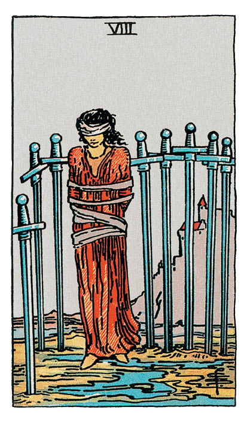

# Huit d'Épée

## Signification

**Type de Carte :** Arcane Mineur de la Suite des Épées associée aux idées, à la réflexion, au « mental » les grandes étapes ou leçons de la Vie
**Élément :** l'Air
**Numérologie / Rang :** 8, associé au mouvement, à l'action et au changement

## Description

Une femme est seule sur la plage. Ses yeux sont bandés, ses bras sont ligotés. Huit épées plantées dans le sol forment une prison autour d'elle. Cependant, le cercle n'est pas complètement fermé. Il y a donc une issue que le bandeau sur les yeux empêche de voir. Seule, loin de la ville et de ses remparts, cette femme paraît bien isolée. Le ciel est gris, le paysage est morne. Il se dégage de la Carte un sentiment d'incertitude et d'absence d'espoir.

## Mots-clés

### À l'endroit
- S'imposer des barrières, des limites
- Se sentir isolé
- Emprisonnement, se sentir paralysé, « coincé », impuissant

### À l'envers
- Libération
- Émancipation
- Dépasser ses peurs pour avancer

## Interprétation

Le Huit d'Épée symbolise le sentiment d'impuissance du Consultant. Perdu, désorienté, le Consultant ne sait pas quoi faire pour dépasser les obstacles ou défis de son environnement. Le Consultant éprouve le sentiment très désagréable d'être « coincé », pris au piège.

Toutefois – et c'est important de le souligner – le Huit d'Épée n'est pas une Carte fataliste. Sur la Carte, la jeune femme pourrait se libérer de ses liens de tissu et retirer le bandeau qui lui couvre les yeux. Elle pourrait regagner le confort et la sécurité de la ville derrière elle.

Le blocage, la « prison » de ces Épées plantées en cercle symbolisent donc d'abord une situation créée par le Consultant lui-même. Assez logiquement, il ou elle pourrait s'en défaire et s'en sortir seul(e). Le blocage est notamment dû à des croyances limitantes de la part du Consultant. Ces croyances limitantes tournent en boucle : « Tu n'es pas capable de… » ; « Un homme comme celui là, s'intéresser à toi !? N'y pense même pas ! » ; « Reprendre une formation à ton âge pour changer de voie, ça ne marchera jamais… » Ces pensées limitantes finissent par définir nos possibles et donc nous ne sommes plus capables de faire autrement, d'innover ou de trouver des solutions.

Il arrive aussi que le sentiment d'impuissance soit généré par des circonstances extérieures. Le Consultant « se réveille », insatisfait de son environnement et de sa vie et se demande comment il ou elle a pu en arriver là.

Dans tous les cas, il est nécessaire de « reprendre la main » sur les circonstances et de se rappeler que dans la vie, on a toujours le choix. Les possibilités qui sont devant soi ne sont peut-être pas idéales, faciles ou souhaitées… mais elles existent ! Il faut être capable de les regarder en face, et choisir la meilleure… ou la moins mauvaise.

## Huit d'Épée et l'Amour

Quand le Huit d'Épée apparaît dans un Tirage dont le sujet est le Domaine sentimental, le Consultant se sent « coincé » dans sa relation amoureuse. La Carte peut apparaître quand le Consultant se pose la question de partir ou de rester… et qu'il n'arrive pas à décider.

Le Consultant est malheureux dans cette relation amoureuse mais des pensées limitantes, les habitudes ou encore la peur de se retrouver seul l'empêche soit de quitter son partenaire soit d'engager un dialogue constructif avec lui. Ces considérations plus ou moins conscientes provoquent également de la culpabilité, ce qui ajoute encore aux difficultés et au malaise.

Plus rarement cette Carte apparaît si le Consultant cherche l'amour. Dans ce cas là aussi, le Consultant se sent « coincé »… mais pas pour les mêmes raisons. Quoi qu'il fasse ou tente, rien ne fonctionne pour rencontrer l'autre. La Carte invite à rechercher ce qui pourrait être mis en œuvre différemment pour renverser la tendance : travailler sur soi et sur ses pensées limitantes, essayer de nouveaux moyens de rencontre, lâcher prise.

## Huit d'Épée et le Travail

Le Consultant se sent en difficulté au travail. Les circonstances peuvent être très diverses avec en point commun l'incapacité à « prendre en main les choses » pour modifier favorablement la situation. Le consultant peut par exemple être « coincé » dans un travail qui ne correspond pas à ses attentes ou motivations profondes, ne pas arriver à atteindre les objectifs qui lui sont fixés, se sentir exclu de l'équipe, du collectif de travail.

Le risque est alors la démotivation et le découragement. Le Huit d'Épée doit interroger le Consultant et le « forcer » à imaginer des scénarios dans lesquels la réussite professionnelle est au rendez-vous. Qu'est-ce que le Consultant arrive à mettre en œuvre pour réussir ? Ces conditions sont-elles réalisables « dans la vraie vie » ? Si oui, comment ?

## Huit d'Épée et les Finances

Le Huit d'Épée est souvent signe que le moment n'est pas le bon pour prendre des décisions importantes, notamment dans le domaine de l'argent et des finances. Le Consultant a une vision partielle de ses possibilités financières, teintées de pensées limitantes… « Je ne peux pas faire ceci parce que je n'ai pas d'argent » ou « Je pourrais faire cela si j'avais telle somme d'argent. »

Bien sûr, il y a des situations pour lesquelles c'est tout à fait vrai. Mais si j'ai besoin d'une voiture, je peux – et il m'appartient de le faire – imaginer des solutions peu coûteuses pour en trouver ou en utiliser une.

## Huit d'Épée et la Guidance

Le Huit d'Épée interroge sur les croyances limitantes que nous avons tous à notre sujet. Ces croyances – fausses ! – nous empêchent de développer entièrement notre potentiel.

En ce sens, le Huit d'Épée symbolise bien le travail de l'Intuitif et du Tarot parce que ce travail consiste justement à voir et à imaginer des possibles et des solutions jusque là insoupçonnés… et donc participer à combattre ces croyances limitantes.

Avez-vous tendance à ne voir que des problèmes quand vos proches vous proposent des solutions ?

Quels projets pensez-vous ne jamais être en mesure de réaliser ? Pourquoi ?

---

*Source : [Vivre Intuitif](https://vivre-intuitif.com/apprendre-le-tarot/signification/epees/le-huit-epee/)*
*Illustration : Tarot de A.E. Waite — Rider-Waite-Smith*
