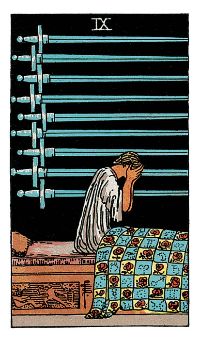

# Neuf d'Épée

## Signification

**Type de Carte :** Arcane Mineur de la Suite des Épées associée aux idées, à la réflexion, au « mental » les grandes étapes ou leçons de la Vie
**Élément :** l'Air
**Numérologie / Rang :** 9, associé à l'aboutissement d'un cycle, à la sagesse, à l'intuition et à la transformation

## Description

Une femme est allongée sur un lit. Elle est vêtue d'une longue tunique blanche et ses yeux sont bandés. Sous le lit, on voit neuf épées à plat sur le sol, alignées en rang parallèle. Derrière, la pièce est à moitié obscure. Il n'y a ni fenêtre, ni miroir, ni décoration. Dans le coin supérieur droit, une draperie couvre un mur nu.

## Mots-clés

### À l'endroit
- Tristesse, inquiétudes, doutes
- Culpabilité
- Peur, anxiété, cauchemars

### À l'envers
- Espoir
- L'issue du tunnel devient visible
- Libération, espoir de guérison

## Interprétation

Le Neuf d'Épée symbolise les peurs, les doutes, les tourments intérieurs du Consultant. Cette nuit-là, la femme n'arrive pas à dormir. Ses pensées sont envahissantes. Elle tente de les apaiser, de s'apaiser. Quand elle y arrive, de nouvelles pensées prennent leur place et l'empêchent de se détendre. Elle ne se rend pas compte qu'elle a bandé ses propres yeux : elle est la seule responsable de son mal-être, même si celui-ci ne se contrôle pas.

Ces pensées sont peut-être la manifestation d'une culpabilité refoulée et/ou la peur de se confronter à la vérité. Ces pensées peuvent aussi faire suite à une rupture amoureuse, à un deuil, à une faute professionnelle, un échec ou tout événement marquant. Ces pensées envahissantes sont d'abord symbolisées par le lit. Elles empêchent la femme de dormir, de lâcher prise, de se reposer.

Le Neuf d'Épée fait écho à d'autres cartes du tarot comme La Maison Dieu – qui est le retournement radical d'une croyance limitante, La Papesse et La Papesse renversée – qui est une mise en relation avec soi et le monde, L'Étoile – qui est le lâcher prise et l'abandon en la confiance de la guidance divine et enfin L'Ange de la Justice – qui est la mise en relation avec les conséquences de nos actes.

La Carte symbolise une peur de l'inconnu, ou plus précisément une peur d'un potentiel avenir. Le Neuf d'Épée est une invitation à lâcher prise sur ses pensées, c'est-à-dire : les laisser venir sans essayer de les contrôler, sans se laisser envahir par elles.

## Neuf d'Épée et l'Amour

Si le Consultant a fait la rencontre de sa vie, mais que sa raison lui dit : « Attention, c'est trop beau pour être vrai ! Cette personne ne peut pas me correspondre autant ! », la Carte l'invite à lâcher prise sur ses pensées. Peut-être que la femme de sa vie est tout simplement là, face à lui, et qu'il ne lui reste plus qu'à accepter que c'est réel.

Le Consultant peut craindre que son partenaire ne le trompe, qu'il soit infidèle, ou qu'il ait des problèmes d'addiction ou de santé. En d'autres termes, il peut craindre que son partenaire ne soit pas une bonne personne. Pourtant, la femme de la Carte n'est pas enchaînée. C'est elle-même qui s'est bandé les yeux. La raison du « trop beau pour être vrai » peut se transformer en « trop beau pour être vrai, mais en bien ! ».

Plus généralement, dans un contexte sentimental, le Neuf d'Épée invite le Consultant à identifier ce qui l'empêche d'accueillir le bonheur dans sa relation amoureuse : est-ce la peur de la trahison, la peur du rejet, la peur d'aimer, la peur de ne pas être à la hauteur ?

## Neuf d'Épée et le Travail

Dans un contexte professionnel, la Carte peut indiquer que le Consultant est victime d'un climat toxique, d'un management qui ne le reconnaît pas à sa juste valeur, qu'il ne se sent pas soutenu. Peut-être que le Consultant ne s'autorise pas à exprimer ses talents, ses compétences, ses potentiels ou que les autres ne l'autorisent pas à le faire.

Le Consultant se sent impuissant(e) ou se sent incompétent(e) dans les tâches qu'on lui confie. Un sentiment de culpabilité peut s'installer si le Consultant ne parvient pas à satisfaire les exigences du management ou celles d'un client.

Dans tous les cas, le Consultant est invitée à identifier le problème et à mettre en place des solutions pour le résoudre. Pour cela, le Consultant doit arrêter de se mentir à lui-même et accepter d'affronter ses peurs, sa culpabilité. Si le Consultant n'est pas en mesure de faire face à la situation, il est conseillé de chercher de l'aide, d'en parler. N'oubliez pas : il n'existe aucune honte à se sentir dépassé, à ressentir de l'impuissance, de la colère ou du découragement.

## Neuf d'Épée et les Finances

La Carte peut indiquer que le Consultant vit un moment délicat en raison de ses finances. Ces moments sont toujours éprouvants. Le sentiment d'insécurité vis-à-vis de l'argent est toujours stressant. C'est dans ces moments que les peurs, les angoisses, l'inquiétude s'installent.

## Neuf d'Épée et la Guidance

La Carte appelle le Consultant à identifier les causes, les origines de ses croyances limitantes, de ses angoisses. Elle l'invite à lâcher prise sur ses pensées pour se confronter à ses peurs.

La Carte l'invite aussi à regarder la vie en face et à accepter qu'il n'existe pas de solutions à tous les problèmes. Par exemple, certains événements de la vie – comme la perte d'un être cher, d'un emploi, la maladie – sont insurmontables.

Le rôle de l'Intuitif n'est pas de donner des solutions. C'est d'aider le Consultant à accepter ce qui ne peut pas être changé et à trouver la force de poursuivre sa route et/ou le courage de prendre en main les choses. L'Intuitif doit guider le Consultant dans la compréhension de lui-même, de son histoire de vie et de l'acceptation de sa condition humaine.

---

*Source : [Vivre Intuitif](https://vivre-intuitif.com/apprendre-le-tarot/signification/epees/neuf-epee/)*
*Illustration : Tarot de A.E. Waite — Rider-Waite-Smith*
