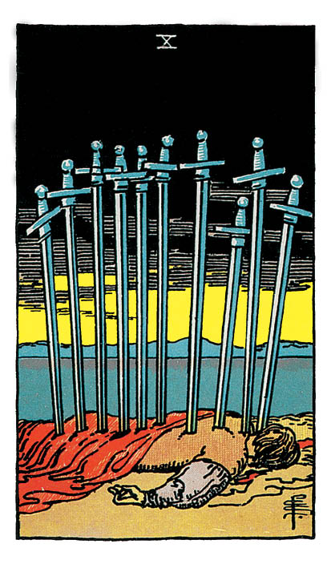

# Dix d'Épée

## Signification

**Type de Carte :** Arcane Mineur de la Suite des Épées associée aux idées, à la réflexion, au « mental » les grandes étapes ou leçons de la Vie
**Élément :** l'Air
**Numérologie / Rang :** 10, associé à l'aboutissement, à l'expérience, à l'enrichissement personnel et à la plénitude

## Description

Une personne est allongée face contre terre, à moitié recouverte d'un drap. Son dos est couvert de dix épées plantées. Le ciel est menaçant, tout orange-rougeâtre et noirâtre. Au loin, un chemin mène à une maison. Un lac sépare la maison de la scène de la Carte.

## Mots-clés

### À l'endroit
- Abandon, rupture, abandon affectif
- Trahison, deuil, faillite, échec
- Maladie grave

### À l'envers
- Espoir
- La chance est au rendez-vous
- Les épreuves s'estompent ou finissent, guérison

## Interprétation

Le Dix d'Épée est la plus malmenée de toutes les cartes du Tarot. La Carte exprime une défaite sans appel. La personne est allongée face contre terre, à moitié recouverte d'un drap. Sur son dos, dix épées sont plantées et l'achèvent. Le ciel est menaçant, tout orangé-noirâtre, comme le fruit d'un incendie. Au loin, une maison apparaît au bout d'un chemin qui part du lac, près duquel se déroule la scène. Cette maison peut symboliser le salut, une issue, la vie.

La personne qui est allongée ne la voit pas. Peut-être qu'elle ne le peut tout simplement pas, ou ne veut pas. Peut-être qu'elle est morte.

Le Dix d'Épée exprime la fin d'un cycle, l'aboutissement d'un parcours qui a mal tourné, l'abandon total et la déchéance. Le Consultant se sent au plus bas, sans perspective ni espoir. Il a tout perdu ou tout gâché.

La Carte peut symboliser le décès d'un être cher. Plus prosaïquement, elle peut symboliser un divorce, une séparation violente, une rupture amoureuse, un échec professionnel ou financier, une trahison, un abandon ou une trahison affective ou sentimentale. Elle est aussi associée à la maladie grave, à un accident, ou à une période de deuil. Elle est aussi associée à un moment charnière de la vie, un moment qui remet en question l'existence du Consultant et lui permet de voir la vie autrement.

En dépit de sa gravité, le Dix d'Épée n'est pas sans issue. La maison qui est au bout du chemin symbolise le salut, une issue positive, la fin de la souffrance et un nouveau départ. La maison est accessible par le chemin qui part du lac. Il est important de ne pas oublier que la personne est à moitié recouverte par un drap. Le drap peut la protéger contre le froid, le vent, la neige. La maison peut lui offrir un abri et un toit.

Le message de la Carte est double : d'une part, il y a un moment de la vie où tout s'écroule et où la personne atteint le fond du gouffre ; d'autre part, il y a toujours un moyen de sortir de ce gouffre. Le Dix d'Épée incarne la fin d'un cycle et le début d'un nouveau. C'est une invitation à tout lâcher pour mieux repartir.

## Dix d'Épée et l'Amour

En amour, le Dix d'Épée est la rupture, la fin brutale, la trahison, le divorce. Elle symbolise la fin d'un cycle, la fin d'une relation amoureuse. Cette fin est d'autant plus brutale que la Carte exprime un sentiment de trahison, de culpabilité ou d'abandon.

## Dix d'Épée et le Travail

Le Dix d'Épée est la Carte de la fin de cycle. En travail, elle peut signifier une fin de contrat, un licenciement, une démission, un départ en retraite, une mise à pied, un échec professionnel ou un burn-out.

## Dix d'Épée et les Finances

Le Dix d'Épée est la Carte de l'échec, de la ruine, de la faillite. La situation est désastreuse, sans issue. Peut-être que la personne a tout perdu en bourse, ou a tout perdu dans une affaire qui a mal tourné, ou a tout perdu dans le cadre d'un héritage, etc. La personne se retrouve dans une situation précaire.

## Dix d'Épée et la Guidance

Le Dix d'Épée est un moment de grâce. La Carte invite le Consultant à accepter que tout est fini et à tout lâcher. La fin du cycle est douloureuse. Le sentiment d'échec est terriblement douloureux. La vie peut sembler impossible. Mais la maison au bout du chemin offre un refuge et la promesse d'un nouveau cycle. Il faut laisser derrière soi la personne, l'événement, l'objet qui sont associés à ce moment difficile. Si vous êtes en deuil, acceptez la tristesse et le manque. Si vous êtes en échec, acceptez-le. La vie continue.

---

*Source : [Vivre Intuitif](https://vivre-intuitif.com/apprendre-le-tarot/signification/epees/dix-epee/)*
*Illustration : Tarot de A.E. Waite — Rider-Waite-Smith*
