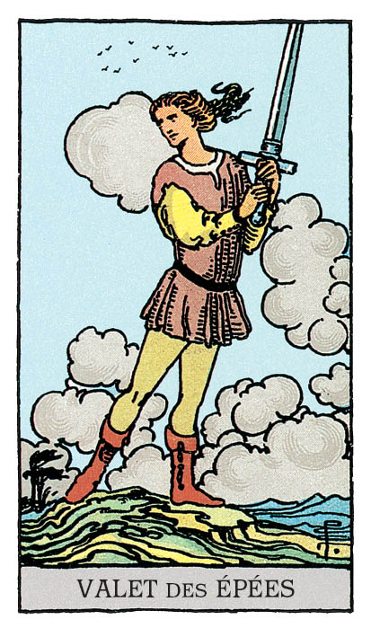

# Valet d'Épée

## Signification

**Type de Carte :** Arcane Mineur de la Suite des Épées associée aux idées, à la réflexion, au « mental »
**Élément :** l'Air
**Numérologie / Rang :** Valet, l'enfant espiègle, associé aux nouvelles, au changement et au potentiel

## Description

Un jeune homme est au sommet d'une falaise surplombant la mer. Cramponné à une épée presque aussi grande que lui, se prépare-t-il à attaquer ? Le vent souffle et les nuages s'amassent dans le ciel. Ils représentent l'agitation du personnage.

## Mots-clés

### À l'endroit
- Ebullition mentale
- Réflexion intense
- Curiosité, potins
- Enfant bavard

### À l'envers
- De belles paroles mais aucune action
- Promesses non tenues
- Précipitation

## Interprétation

Le Valet d'Epée représente l'enfant qui apprend, qui découvre le monde qui l'entoure et s'efforce à le comprendre, à se l'approprier. En ce sens, son Energie est passionnée, enthousiaste. Tout est nouveau pour lui et il n'a qu'une envie : partager ses découvertes et ses idées avec les autres. Vous êtes exactement dans cette Energie en ce moment : vous avez des idées plein la tête et vous ressentez un élan incroyable pour aller de l'avant. A ce stade, pour que vos désirs puissent se matérialiser et se concrétiser, vous devez vous entourer de personnes qui vous écoutent, vous accompagnent et vous encouragent. Evitez les rabat-joies et ne laissez personne étouffer votre enthousiasme.

Le Valet d'Epée représente également la communication, les idées et le partage d'informations. Vous venez peut-être de découvrir quelque chose – une information, une passion, une cause… – et vous avez besoin d'en parler autour de vous, de sensibiliser votre entourage à la question. Vous êtes tellement éprise du sujet que cet exercice est facile pour vous, vous pourriez en parler toute la journée. Attention à ne pas saturer votre auditoire, cela aurait l'effet inverse de ce que vous recherchez.

Dans un Tirage, il arrive que le Valet d'Epée soit un messager. Dans ce cas, son message vous « met la puce à l'oreille », vous pousse à vouloir en savoir plus. Le message peut aussi prendre la forme d'une véritable révélation. Ce message inattendu peut avoir un impact important ou nécessiter une décision de votre part. Prenez le temps de la réflexion.

Enfin, comme toutes les Cartes de Cour, le Valet d'Epée peut représenter une personne « de la vraie vie » dans votre entourage ou une personne que vous allez bientôt rencontrer. Le Valet d'Epée peut, dans ce cas, représenter une personne pleine de fougue, avec qui l'échange intellectuel peut tantôt être passionnant, tantôt une vraie « prise de tête ». Cela dit, leur curiosité insatiable sur le monde est un exemple à suivre et à leur contact, vous aussi vous apprenez beaucoup.

## Valet d'Épée et l'Amour

Si vous recherchez l'Amour, ouvrez l'oeil et repérez les personnes bavardes et à l'esprit agile. Repérez les personnes qui sont curieuses d'en savoir plus sur vous, vos goûts et vos passions… Elles pourraient poser ces questions non pas par politesse mais par envie de vous connaître mieux.

Le Valet d'Epée vous invite également à vous mettre dans son Energie enthousiaste, dans son envie de rencontrer et de découvrir d'autres personnes. Sortez, rencontrez du monde et engagez la conversation, même si l'endroit ou les circonstances paraissent incongrus.

Si vous êtes en couple, le Valet d'Epée indique que vous devez reprendre le fil de la communication avec votre partenaire. Il est possible que les non-dits, voire les secrets, pèsent sur votre relation. Il se peut que le Valet d'Epée représente un enfant et que les difficultés de celui-ci provoquent des tensions dans votre couple. Il est temps de vous dire la vérité, d'exprimer vos sentiments et d'écouter l'autre avec bienveillance.

## Valet d'Épée et le Travail

L'Energie du Valet d'Epée aime apprendre, découvrir et expérimenter. Il est probablement apparu pour faire écho à votre besoin de changement, d'ouverture de votre horizon professionnel. Si vous souhaitez vous former, acquérir de nouvelles compétences, le Valet d'Epée est le signe que le moment est venu de vous lancer.

Toutefois, bien que vous soyez impatiente et enthousiaste, attention à ne pas foncer « tête baissée » sans avoir posé toutes les questions et obtenu toutes les réponses. Vous devez savoir exactement dans quelle voie vous vous engagez. Le Valet d'Epée peut indiquer une information cachée, un retard alors prenez votre temps et faites l'effort de bien comprendre l'impact d'un changement à moyen et long terme.

## Valet d'Épée et les Finances

Vous avez envie de mettre en oeuvre de nouveaux outils, de nouvelles habitudes pour attirer l'Abondance dans votre vie. C'est une excellente chose ! C'est enthousiasmant ! Toutefois, vous êtes encore en phase de découverte et d'apprentissage de ces nouveaux outils. Ne prenez pas de risques inconsidérés. Prenez le temps de réfléchir, de vous documenter pour établir un plan d'action solide pour atteindre vos objectifs financiers.

## Valet d'Épée et la Guidance

Le Valet d'Epée est apparu pour vous parler des difficultés de communication que chacun rencontre parfois avec une autre personne. Une personne têtue, bornée, qui ne comprend rien à la situation et qui ne fait pas preuve d'empathie pour comprendre la position de l'autre.

Parfois, cette personne, c'est vous, c'est moi. Quand le dialogue est difficile, il faut redoubler d'attention. Il faut réussir à se taire pour écouter. Le Valet d'Epée est apparu pour vous rappeler que la spiritualité, l'Amour inconditionnel, le pardon, l'écoute se pratiquent aussi – et surtout ! – dans ces moments d'échanges du quotidien.

---

