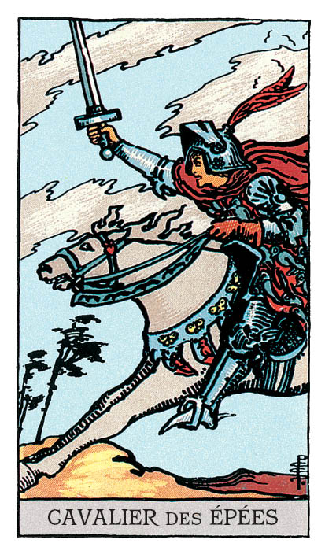

# Cavalier d'Épée

## Signification

**Type de Carte :** Arcane Mineur de la Suite des Épées associée aux idées, à la réflexion, au « mental »
**Élément :** l'Air
**Numérologie / Rang :** Cavalier, associé aux actions, aux projets et à la réalisation concrète

## Description

Un jeune chevalier donne la charge et se lance, épée à la main, dans la bataille. Il est cramponné à son cheval lancé au galop. Il se dégage de son attitude une grande Energie. Il s'abandonne complètement dans ce moment dynamique et rempli d'élan.

Dans le Ciel, les nuages semblent orageux. Le vent fait plier les arbres. Son vêtement est orné de papillons et d'oiseaux. Ce sont autant de symboles de l'Energie omniprésente de l'Elément Air.

## Mots-clés

### À l'endroit
- Donner son opinion
- Défendre une cause
- Etre totalement orienté vers son objectif
- Frapper un grand coup pour l'atteindre

### À l'envers
- Energie et pensées dispersées
- Ne pas réfléchir avant d'agir
- Ne pas se soucier des conséquences de ses actions

## Interprétation

Comme chez le Cavalier de Bâton, il émane du Cavalier d'Epée une Energie inarrêtable, irrésistible, presque invulnérable. Les Cavaliers étant les « adolescents » de la Cour, ils se comportent de façon extrême, « jusqu'au boutiste ». Ces deux Cavaliers partagent l'envie d'atteindre leur objectif aussi vite que possible. Pour le Cavalier d'Epée, l'objectif comporte nécessairement une part de communication, une vision, des idées… C'est donc une Energie qui veut convaincre et rallier à sa cause d'autres personnes aussi motivées que lui. Contrairement au Cavalier de Bâton, l'Energie du Cavalier d'Epée n'est pas impulsive. Le Cavalier d'Epée réfléchit très vite et donc agit très vite, ce qui peut surprendre celles et ceux qui n'ont pas l'esprit aussi vif.

Le Cavalier d'Epée est une Carte qui représente l'ambition et la détermination à réussir – deux qualités remarquables. Dans cette Energie, il est impossible de vous arrêter. Vous êtes focalisée à 200% sur votre objectif et plus rien – ou presque – ne compte à vos yeux. Vous ne pouvez pas envisager autre alternative que votre réussite. Votre enthousiasme est contagieux car vous exprimez vos idées avec éloquence et conviction.

Cependant, le Cavalier d'Epée, par inexpérience ou refus d'écouter les mises en garde de son entourage, ne prend pas toujours la mesure des projets dans lesquels il se lance… Ainsi, dans un Tirage, sa présence peut vous alerter sur votre manque de préparation, votre manque de vision globale du problème voire des dangers qui pourraient vous attendre sur cette route. Il peut aussi vous alerter sur les « raccourcis » que vous seriez tenté(e) de prendre vers le succès : seront-ils vraiment efficaces sur le long terme ?

## Cavalier d'Épée et l'Amour

Si vous recherchez l'Amour, ouvrez l'oeil et repérez les personnes qui réfléchissent vite et agissent encore plus vite ! L'irruption de ce Cavalier d'Epée dans votre vie change votre quotidien et bouscule vos habitudes. Si cette personne souhaite nouer une relation durable avec vous, vous le saurez rapidement car il / elle pourrait bien « brûler les étapes » en vous courtisant.

Il est possible également que vous soyez vous-même dans l'Energie du Cavalier d'Epée pour atteindre votre objectif amoureux. Dans ce cas, vous n'avez pas froid aux yeux, vous ne laissez plus la peur contrôler vos rencontres et vous allez au-devant des autres comme jamais auparavant.

Si vous êtes en couple, le Cavalier d'Epée indique que vous souhaitez que votre relation avance… et vite ! Vous souhaitez plus d'engagement pour construire votre couple et passer à l'étape supérieure comme vivre ensemble ou avoir un enfant. Communiquez ces souhaits à votre partenaire et voyez si vous êtes tous les deux sur la même longueur d'onde.

## Cavalier d'Épée et le Travail

Vous êtes dans une période d'intense focalisation sur vos objectifs professionnels. Vous êtes déterminé(e) à réussir et à vaincre vos adversaires, si adversaire il y a.

Le Cavalier d'Epée vous invite à utiliser son Energie et à vous comporter comme lui le ferait pour atteindre vos objectifs. « Quick wins », réseautage, expressions de vos idées, demande de responsabilités supplémentaires : exprimez-vous et faites-le rapidement ! Cela ne veut pas dire que vous devez vous comporter de façon irréfléchie, au contraire, mais le moment est opportun pour franchir un cap dans vos projets professionnels. Travaillez votre communication, trouvez les mots pour convaincre ou pour exprimer votre vision… et foncez !

## Cavalier d'Épée et les Finances

Dans l'Energie dynamique et impatiente du Cavalier d'Epée, il est facile de prendre des décisions hâtives et / ou risquées concernant vos finances. Il serait tentant également d'écouter les conseils d'un Cavalier d'Epée qui vous promet un retour sur investissement fantastique ou un succès incomparable pour augmenter vos revenus.

Prudence ! L'Abondance aime la réflexion et la construction d'un plan d'action solide pour l'atteindre.

Utilisez donc plutôt l'Energie réfléchie du Cavalier d'Epée plutôt que sa rapidité d'action. Utilisez son Epée pour trancher dans vos dépenses, en prenant soin de conserver un budget pour ce qui vous stimule intellectuellement et ce que vous considérez comme indispensable. Sur ces nouvelles bases, l'Abondance pourrait arriver bien plus vite que vous ne le croyez.

## Cavalier d'Épée et la Guidance

Le Cavalier d'Epée est apparu pour vous dire qu'il est nécessaire de vous créer des pauses et des espaces de Spiritualité dans votre vie.

Si vos pensées et vos réflexions sont systématiquement orientées vers l'action – « agir pour » – vous ne disposez plus de suffisamment d'Energie pour penser et réfléchir à votre « agir pourquoi ? ».

Or, le « pourquoi ? » est essentiel ! Quand vous avez identifié votre « pourquoi ? », ce que vous n'avez pas envie de faire prend une dimension toute différente. Vous concevez ces tâches désagréables comme nécessaires à l'atteinte de votre objectif… et elles prennent un autre sens.

Sachez baisser les armes et retrouver le calme, le silence. Sachez vous retrouver avec vous-même… en laissant les tracas du quotidien de côté.

Cet espace mental est essentiel pour cheminer spirituellement. Faites-vous ce cadeau régulièrement.

---

*Source : [Vivre Intuitif](https://vivre-intuitif.com/apprendre-le-tarot/signification/epees/cavalier-d-epee/)*
*Illustration : Tarot de A.E. Waite — Rider-Waite-Smith*
