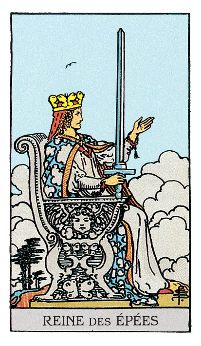

# Roi d'Épée

## Signification

**Type de Carte :** Arcane Mineur de la Suite des Épées associée aux idées, à la réflexion, au « mental »
**Élément :** l'Air
**Numérologie / Rang :** Roi, présence forte et assurée, côté masculin (Yang) des choses

## Description

Un homme est assis sur un trône de pierre. Il regarde fermement devant lui. Vers le Ciel, il brandit de sa main droite une longue épée. Son expression est extrêmement déterminée.

Derrière le Roi, le Ciel est dégagé. Les arbres ne sont pas pliés par le vent. Ce calme de l'Elément Air représente la lucidité et l'esprit analytique du Roi d'Epée.

## Mots-clés

### À l'endroit
- Justesse et vérité
- Etre dans la réflexion plutôt que l'émotion
- Réfléchir et bien communiquer ses idées

### À l'envers
- Manipulation
- Abus, harcèlement
- Faire preuve de cynisme, se montrer sans pitié

## Interprétation

Comme les autres Rois, le Roi d'Epée est une présence conquérante, puissante et indéfectible. Le Roi d'Epée veut changer le monde avec ses idées, sa capacité à convaincre et son autorité naturelle. Ses émotions ne faussent jamais son jugement car il est capable de séparer hermétiquement l'émotionnel du rationnel.

Quand il apparait dans un Tirage, il vous demande d'utiliser la même approche face à votre problématique. Le détachement et le sang froid sont de mise pour analyser la situation en toute objectivité. Sur la base des informations recueillies, vous serez amené(e) à prendre une décision impactante. C'est pour cela que l'analyse de la situation est si importante. Restez juste et honnête dans votre évaluation de la situation et des personnes… pour que votre décision soit juste et impartiale elle aussi. Une fois la décision prise, il est possible que vous ayez à convaincre autour de vous, alors, travaillez vos arguments et soyez prêt(e) à répondre sur tous les points.

Comme toutes les Cartes de Cour, le Roi d'Epée peut représenter une personne « de la vraie vie » dans votre entourage ou une personne que vous allez bientôt rencontrer. Le Roi d'Epée est dans ce cas une personne très intelligente, convaincante, qui s'exprime admirablement bien, avec beaucoup de clarté dans ses propos. Cette personne appelle le respect par son autorité naturelle et sa faculté à être toujours juste dans ses jugements et décisions.

Plus précisément, le Roi d'Epée représente souvent un professionnel dont le conseil vous est nécessaire pour régler votre problématique. Ses compétences et sa posture résolument neutre vis-à-vis de votre problématique lui permettent de vous accompagner de la meilleure façon pour régler votre problème ou atteindre votre objectif. Il peut s'agir d'un avocat, d'un notaire, d'un conseiller… plus rarement d'un médecin.

## Roi d'Épée et l'Amour

Si vous recherchez l'Amour, regardez autour de vous et cherchez une personne charismatique, écoutée et respectée des autres. Cette personne ne se laisse pas déborder ou commander par ses émotions, alors, soyez prêt(e) à gagner son Coeur par l'échange constructif et des actions alignées avec vos valeurs partagées. Si flirter est fun et « sans engagement », le plus sûr moyen de gagner le Coeur d'un Roi d'Epée est de respecter ses engagements et de construire sur la confiance. Ne soyez pas surpris(-se) si votre Roi d'Epée n'arrive pas à exprimer ses sentiments… Bien qu'il ou elle soit éloquent pour exprimer ses idées, exprimer ses sentiments lui est bien plus difficile.

Sur le plan amoureux, il est possible que vous ayez besoin de vous mettre dans l'Energie du Roi d'Epée. Dans ce cas, vous devez faire preuve de logique, analyser votre situation et communiquer avec votre partenaire de façon directe. Il est possible que vous ayez à prendre une décision importante ensemble. Le dialogue est essentiel pour prendre en compte tous les aspects de la situation et acter la décision optimale.

## Roi d'Épée et le Travail

Dans un Tirage concernant le travail ou votre avenir professionnel, le Roi d'Epée représente le plus souvent une personne décisionnaire, un directeur(-trice), un manager. Cette personne est respectée dans son domaine d'expertise et ses conseils sont précieux. Avant de solliciter cette personne pour une promotion ou toute opportunité professionnelle, préparez vos arguments, axez votre présentation sur du concret (chiffres, analyses…) et évitez de laisser l'émotion envahir votre discours. Si le Roi d'Epée – qui peut se présenter sous les traits d'une femme – prend la peine de vous donner des conseils, suivez-les scrupuleusement.

Il est possible aussi que vous ayez besoin de vous mettre dans l'Energie du Roi d'Epée pour faire avancer vos projets professionnels. Dans ce cas, soyez méthodique dans votre analyse, prenez le temps de prendre la bonne décision. Une fois celle-ci actée, agissez sans délai pour la mettre en oeuvre et tâchez de travailler systématiquement vers l'atteinte de cet objectif. Restez juste et « pro » dans ce que vous entreprenez et ne mettez pas en défaut vos valeurs personnelles.

## Roi d'Épée et les Finances

Côté Finances, le Roi d'Epée indique que vous avez besoin de faire le point de façon rationnelle – et non émotionnelle – sur vos dépenses et votre budget. Il est possible que ce bilan soit difficile à faire et/ou à vivre pour vous. Mais regarder la vérité en face est une des qualités du Roi d'Epée sur lesquelles vous pouvez vous appuyer, pour mieux repartir. Faites un travail profond d'analyse de votre budget – recette et dépenses – posez vos objectifs financiers – salaire, épargne, remboursement – et listez les étapes logiques qui vont vous permettre de vous remettre à flot.

## Roi d'Épée et la Guidance

Le Roi d'Epée est apparu pour vous questionner sur la place du rationnel dans votre cheminement spirituel. Lorsque que l'Eveil ou le cheminement spirituel sont évoqués, ils sont associés à l'Energie de la Reine de Coupe ou de La Grande Prêtresse, figures fluides, connectées à leurs émotions et à leur Intuition.

Le Roi d'Epée rappelle que se reposer de façon aveugle sur son Intuition invite à la paresse intellectuelle. Autrement dit, ce que l'Intuition éveille, votre cerveau rationnel veut l'explorer, le comprendre et l'approfondir. C'est ce dialogue entre intuition et compréhension qui permet la maîtrise des pratiques intuitives… et donne les meilleurs résultats.

Le Roi d'Epée vous signifie également que nouvelles idées, de nouvelles perspectives sont à ajouter à votre cheminement. Comme une recette de cuisine qui s'améliore au fil du temps, vous avez envie d'essayer un nouvel ingrédient et de nourrir votre progression de nouvelles pratiques. Offrez-vous un livre, découvrez de nouvelles façons de faire et osez les expérimenter. Nourissez votre Coeur avec des idées inédites.

---

*Source : [Vivre Intuitif](https://vivre-intuitif.com/apprendre-le-tarot/signification/epees/roi-epee/)*
*Illustration : Tarot de A.E. Waite — Rider-Waite-Smith*
